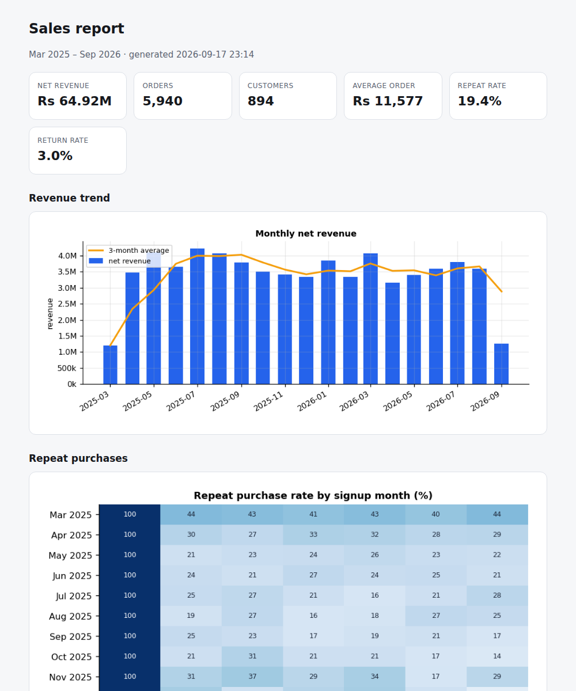

# Sales Insights

**Live demo:** https://umer-78.github.io/sales-insights/

[](https://github.com/umer-78/sales-insights/actions/workflows/ci.yml)


A data-analysis project that starts where real work starts: a **messy orders
export**. It cleans the file (and says what it changed), then answers the
questions a shop owner actually asks — what sells, who comes back, which
customers are worth chasing, and when the year is busy — and writes a
self-contained HTML report.



## The pipeline

```
orders.csv ──▶ clean (with a report) ──▶ analysis ──▶ CLI tables ──▶ HTML report
```

### 1. Cleaning that tells you what it did

The sample export has the problems real ones have: duplicate rows, `Rs 9,800`
as a price, blank prices, missing customer ids, returns as negative quantities,
`PK` / `pakistan` / `Pakistan`, and some dates written day-first.

```text
6,120 rows in, 5,940 out
  120 exact duplicates removed
  0 rows with an unparseable date dropped
  60 rows with no price dropped
  118 rows without a customer id kept as 'guest'
  179 returns kept as negative quantities
  2,958 country spellings normalised
```

Dates are parsed **by explicit format**, never inferred per row: letting pandas
guess turns `03/04/2026` into 4 March on one row and 3 April on the next, and a
test pins that behaviour down.

### 2. Analysis

| Question | Function |
|---|---|
| How is revenue trending, net of returns? | `monthly_summary` |
| What sells, and what comes back? | `top_products` (with return rates) |
| Do customers come back? | `cohort_retention` (guests excluded — they cannot be followed) |
| Who should we call? | `rfm_segments` + `segment_summary` |
| When is the year busy? | `seasonality` (month index and weekday) |
| Where does revenue come from? | `channel_country` |

### 3. Report

`sales report` writes one HTML file with the charts embedded as data URIs, so it
can be e-mailed or printed with nothing to lose on the way.

## Use it

```bash
git clone https://github.com/umer-78/sales-insights.git
cd sales-insights
python -m venv .venv && source .venv/bin/activate
pip install -e ".[dev]"

sales sample                  # writes data/orders.csv, mess included
sales summary                 # headline numbers and the monthly trend
sales products                # best sellers and return rates
sales cohorts                 # repeat purchase rate by signup month
sales segments                # RFM segments and the top customers
sales seasonality             # month-of-year and weekday patterns
sales report                  # reports/sales-report.html
sales clean -o data/orders-clean.csv
```

Point any command at your own export with `-d path/to/orders.csv`. The expected
columns are `order_id, order_date, customer_id, sku, product, category,
quantity, unit_price, discount_percent, country, channel`.

```text
$ sales segments
891 identifiable customers

segment               customers      revenue   share  avg orders
champions                   242    Rs 39.78M   61.0%        13.4
at risk (valuable)           90     Rs 7.73M   11.8%         5.9
needs attention             177     Rs 6.25M    9.6%         3.8
new or occasional           149     Rs 5.17M    7.9%         3.2
lost                        178     Rs 4.75M    7.3%         2.4
loyal                        55     Rs 1.56M    2.4%         5.5
```

## What the sample data says

Roughly 65 million rupees of net revenue over 19 months from about 900
customers. Segmentation puts **61% of revenue with 27% of customers**
("champions"), and the average repeat rate after the first month is about 19%.
The data is generated, so those numbers describe the generator, not any real
shop — what they demonstrate is that the pipeline produces the right kind of
answer.

## Tests

```bash
ruff check .
python -m pytest -q     # 15 tests
```

Including: prices with symbols and blanks, day-first dates, the cleaning report
adding up (rows in = rows out + everything dropped), returns staying negative,
revenue applying discounts, cohorts starting at 100% and excluding guests, RFM
scores in range with champions genuinely spending more and buying more recently,
the seasonality index averaging 100, and the report embedding its charts.

## License

[MIT](LICENSE)
